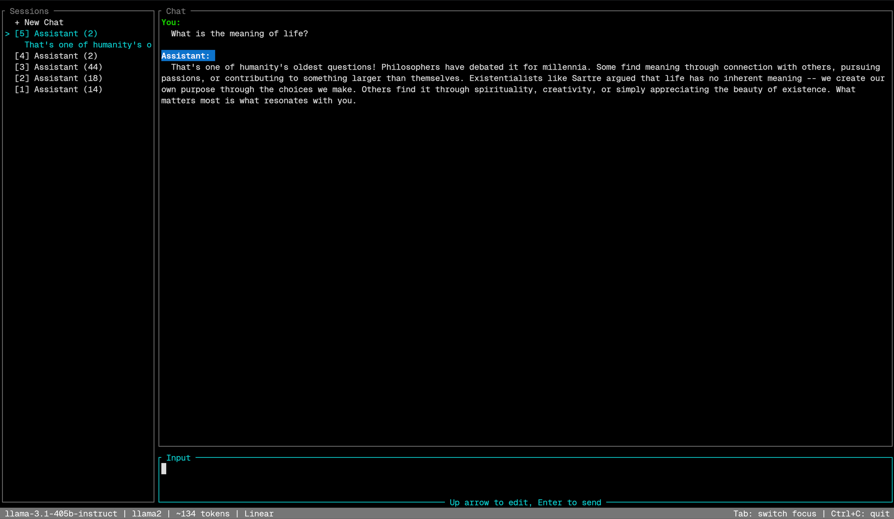

# LibLLM

A keyboard-driven terminal chat client for local LLMs -- conversation branching, encrypted local storage, character cards, and worldbooks, all from the terminal.



## Install

```sh
curl -fsSL https://raw.githubusercontent.com/wsquarepa/LibLLM/master/install.sh | sh
```

This downloads the latest stable binary for your platform and installs it to `~/.local/bin`. See [Other install methods](#other-install-methods) for building from source, platform binaries, or installing into a custom location.

## Quickstart

**Prerequisites:** a running [llama.cpp](https://github.com/ggerganov/llama.cpp)-compatible API server exposing an OpenAI-compatible `/v1/chat/completions` endpoint. The default URL is `http://localhost:5001/v1`.

1. Run `libllm` in your terminal.
2. Set a passkey when prompted on first launch. This encrypts your local data directory.
3. Type a message and press Enter. Responses stream in real-time and auto-save after each exchange.

To connect to a server on a different address:

```sh
libllm --api-url http://localhost:8080/v1
# or via environment variable
export LIBLLM_API_URL=http://localhost:8080/v1
```

## Why LibLLM is different

- **Branching conversations.** Retry or edit any message to fork the conversation, then navigate between branches like a tree. You never lose a previous response.
- **Encrypted local storage.** All sessions, characters, and worldbooks live in a single SQLite database encrypted by default with SQLCipher (AES-256). Nothing leaves your machine.
- **TUI and pipe-friendly CLI.** Full keyboard-driven TUI for interactive use, plus `libllm -m "prompt"` for one-off messages and `--continue` for persistent scripted conversations.

## Common workflows

### Interactive chat

```sh
libllm
```

### One-off message from a script

```sh
libllm -m "Summarize this file" < document.txt
echo "Translate to French: hello world" | libllm -m -
```

These are ephemeral -- nothing is saved. See [More workflows](#more-workflows) for persistent scripted conversations.

### Branching a conversation

- `/retry` regenerates the last response (creates a new branch).
- Press Up arrow (with empty input) to navigate to a previous message, then Enter to edit it (creates a new branch).
- Alt+Left / Alt+Right to switch between sibling branches.

---

## Concepts

### Conversation branching

Messages in LibLLM form a tree, not a flat list. When you use `/retry` to regenerate a response or navigate to a message and edit it, the new version becomes a sibling branch of the original. You can navigate between branches with Alt+Left/Right, and branch indicators like `[1/3]` appear at fork points.

### Character cards and roleplay mode

Character cards define an AI persona with a name, description, personality, and scenario. LibLLM supports JSON and PNG formats (SillyTavern-compatible `tEXt` chunk extraction). Use the `/character` command in the TUI to create, import, or manage cards. Template variables `{{char}}` and `{{user}}` are substituted automatically.

Roleplay mode is activated by passing both `-c` (character) and `-p` (persona) on the command line. Both flags are required together -- you cannot use one without the other. In roleplay mode, the `/system` and `/persona` TUI commands become read-only viewers.

### Worldbooks

Worldbooks (lorebooks) provide keyword-activated context injection. Each entry has a set of trigger keywords; when those keywords appear in the conversation, the entry's content is injected into the prompt. This lets you build persistent lore, facts, or instructions that activate only when relevant.

### Auto-summarization

Long conversations are summarized in the background so older turns can be compressed into a single `Summary` node instead of being dropped outright. The summarizer kicks in once enough new messages have accumulated past the context budget (`trigger_threshold`), runs a non-streaming completion against the main API (or a separate `api_url` under `[summarization]`), and inserts the result into the tree. Summary nodes render as a compact dimmed line. Disable for a single run with `--no-summarize`, or set `enabled = false` under `[summarization]` in `config.toml`.

### Token counting

LibLLM probes the configured API at startup to pick a tokenizer backend: llama.cpp's `/tokenize`, KoboldCPP's `/api/extra/tokencount`, or a 4-chars-per-token heuristic when neither is available. The chat pane shows the authoritative token total with a percent-of-context indicator colored by the `token_band_ok` / `token_band_warn` / `token_band_over` theme keys. While you are typing, the input box shows an `Est.` prefix; the count becomes authoritative once the server tokenizer confirms it.

### Encryption

By default, LibLLM stores all data in a SQLite database encrypted with SQLCipher (AES-256). The encryption key is derived from your passkey using Argon2id. You set your passkey on first launch, and it is required each time you start the TUI.

To skip encryption, use `--data -d <path> --no-encrypt` (data stored in a plain unencrypted SQLite database, no passkey prompt).

There is no passkey recovery mechanism. If you forget your passkey, the encrypted database cannot be decrypted.

## More workflows

### Persistent scripted conversation

```sh
# First message (creates a new session, prints UUID to stderr)
libllm -d ./project-data --no-encrypt -m "Explain quantum computing"
# Output: Session: 550e8400-e29b-41d4-a716-446655440000

# Continue the conversation
libllm -d ./project-data --no-encrypt -m "Now explain it to a 5-year-old" \
  --continue 550e8400-e29b-41d4-a716-446655440000
```

### Load a character card with a persona

```sh
# Roleplay mode requires both -c and -p
libllm -c character_name -p persona_name
```

Or use the `/character` and `/persona` commands inside the TUI to browse and manage cards and personas.

### Toggle worldbooks

Use the `/worldbook` command inside the TUI to enable or disable worldbooks for the current session.

### Use a custom data directory

```sh
# Plaintext mode with custom data directory
libllm -d ./my-project --no-encrypt

# Encrypted mode with custom data directory
libllm -d ./my-project --passkey mypasskey
```

The data directory is created automatically if it does not exist. An existing non-empty directory must already be a LibLLM data directory (contain `config.toml` or `data.db`). Encryption mode must be consistent: `--passkey` is rejected on unencrypted directories, and `--no-encrypt` is rejected on encrypted ones.

### Override the system prompt

```sh
libllm -r "You are a concise technical writer"
```

The `-r` flag forcibly overrides the system prompt regardless of session or config state. In TUI mode, `/system` becomes a read-only viewer showing the forced prompt in red.

### Override sampling parameters

```sh
libllm --temperature 0.5 --top-p 0.9 --max-tokens 512
```

CLI sampling flags override config file values. Overridden fields appear in red in the `/config` dialog and cannot be edited until the flag is removed.

### Provide passkey non-interactively

```sh
LIBLLM_PASSKEY=mypasskey libllm -d ./data
# or
libllm -d ./data --passkey mypasskey
```

### Authenticate to a protected API

LibLLM supports five outbound authentication schemes for the llama.cpp-compatible API: `none`, `basic`, `bearer`, `header`, and `query`. Configure them through the `[auth]` section of `config.toml`, the `/config` → Authentication sub-dialog, or CLI flags. Secrets must come from the config file or environment variables -- they have no CLI flag so they do not leak into process listings.

```sh
# Bearer token (secret in env, type selected on CLI)
LIBLLM_AUTH_BEARER_TOKEN=sk-... libllm --auth-type bearer

# Basic auth
LIBLLM_AUTH_BASIC_PASSWORD=hunter2 libllm --auth-type basic --auth-basic-username alice

# Custom header
LIBLLM_AUTH_HEADER_VALUE=my-value libllm --auth-type header --auth-header-name X-Api-Key

# Query-string parameter
LIBLLM_AUTH_QUERY_VALUE=my-value libllm --auth-type query --auth-query-name api_key
```

Precedence for each field is CLI/env > `[auth]` in `config.toml`. Non-secret fields (type, basic username, header/query name) persist to the config file when edited through `/config`; secrets persist only when entered through the TUI dialog.

## Other install methods

### Install script options

Set `INSTALL_DIR` to override the install location. For private repositories, set `GITHUB_TOKEN` or `GH_TOKEN` before running. Re-running the install script on a system that already has libllm will automatically run `libllm update` instead.

### From release

Pre-built binaries for Linux (x86_64, aarch64), macOS (x86_64, aarch64), and Windows (x86_64, aarch64) are available as [releases](../../releases). The [stable release](../../releases/tag/stable) is updated on every push to `master`. Branch builds are published as pre-releases when changes are pushed to any other branch.

### From source

Requires [Rust](https://rustup.rs/) (stable toolchain).

```sh
git clone https://github.com/wsquarepa/LibLLM.git
cd LibLLM
cargo build --release --workspace
# binary at target/release/client
```

## Updating and recovery

### Update

```sh
libllm update                    # interactive picker (TTY) or update stable (non-TTY)
libllm update stable             # update stable explicitly
libllm update feature/branch     # switch to a branch build
libllm update -y feature/branch  # skip the channel-switch confirmation
```

The bare `libllm update` opens an arrow-key picker when stdin and stderr are both TTYs. In non-interactive shells (pipes, CI, agent sessions) it updates to `stable` directly, preserving scriptable behavior.

Switching between channels shows a confirmation prompt since branch builds may introduce data format changes. Use `--yes` / `-y` to skip the prompt.

### Recover

```sh
libllm recover                   # interactive menu (TTY) or subcommand help (non-TTY)
libllm recover list              # list backup points
libllm recover restore <id>      # restore a specific backup
libllm recover verify [--full]   # verify backup chain integrity
libllm recover rebuild-index     # rebuild backup index from disk
```

The bare `libllm recover` opens an action menu on a TTY. In non-interactive shells it prints the subcommand help to stdout and exits `0`, so wrappers and agents get discoverable output.

## CLI reference

| Flag | Description |
|---|---|
| `-d`, `--data` | Data directory path (creates if needed, uses path directly) |
| `--continue` | Continue a previous session by UUID (use with `-m` and `-d`) |
| `-m`, `--message` | Send a single message and exit (`-` for stdin) |
| `-r`, `--system-prompt` | Override the system prompt (forces read-only `/system` in TUI) |
| `-p`, `--persona` | User persona to use (requires `-c`) |
| `-c`, `--character` | Character card name or path to `.json`/`.png` file (requires `-p`) |
| `-t`, `--template` | Instruct preset: `Mistral V3-Tekken`, `Llama 3 Instruct`, `ChatML`, `Phi`, `Alpaca`, `Raw` |
| `--api-url` | API base URL (env: `LIBLLM_API_URL`) |
| `--no-encrypt` | Disable session encryption (requires `-d`) |
| `--passkey` | Encryption passkey (env: `LIBLLM_PASSKEY`, requires `-d`). **Visible in process listings** (`ps`, `/proc`); prefer the interactive prompt or `LIBLLM_PASSKEY` env var. |
| `--temperature` | Sampling temperature |
| `--top-k` | Top-K sampling |
| `--top-p` | Top-P (nucleus) sampling |
| `--min-p` | Min-P sampling |
| `--repeat-last-n` | Repeat penalty window size |
| `--repeat-penalty` | Repeat penalty strength |
| `--max-tokens` | Maximum tokens to generate (`-1` for unlimited) |
| `--tls-skip-verify` | Skip TLS certificate verification |
| `--no-summarize` | Disable background auto-summarization for this run |
| `--auth-type` | API authentication scheme: `none`, `basic`, `bearer`, `header`, `query` |
| `--auth-basic-username` | Username for Basic auth (password via `LIBLLM_AUTH_BASIC_PASSWORD`) |
| `--auth-header-name` | Header name for Header auth (value via `LIBLLM_AUTH_HEADER_VALUE`) |
| `--auth-query-name` | Query-parameter name for Query auth (value via `LIBLLM_AUTH_QUERY_VALUE`) |
| `--debug` | Write debug log to a specific path instead of an auto-generated temp file |
| `--timings` | Write a timings report to `./timings.log` or an optional custom path |
| `--cleanup` | Remove LibLLM temporary debug logs and exit |

### Subcommands

```sh
# Update to the latest stable build (interactive picker on TTY, stable on non-TTY)
libllm update

# Update stable explicitly or switch to a branch build
libllm update stable
libllm update feature/branch

# Edit a character card or worldbook in $EDITOR
libllm edit character <name>
libllm edit worldbook <name>

# Import characters, worldbooks, personas, or system prompts from files
libllm import card.json                        # auto-detects character vs worldbook
libllm import card.png                         # PNG character card
libllm import --type persona persona.txt       # .txt requires --type
libllm import --type prompt system.txt
libllm import card.json lore.json card2.png    # batch import

# Direct database access (alias: `database`). See "Direct database access" below.
libllm db sql "SELECT slug, name FROM personas;"
libllm db shell                                # interactive REPL
libllm db dump backup.db                       # decrypted SQLite copy
libllm db import edited.db                     # replace contents from a plaintext file
```

### CLI override behavior

Flags that overlap with `/config` fields (`--api-url`, `--template`, `--temperature`, `--top-k`, `--top-p`, `--min-p`, `--repeat-last-n`, `--repeat-penalty`, `--max-tokens`, `--tls-skip-verify`) always take priority over config file values. In the TUI, overridden fields appear in red in the `/config` dialog and cannot be edited. The underlying config.toml values are preserved.

## TUI keyboard shortcuts

| Key | Context | Action |
|---|---|---|
| Enter | Input | Send message (queued if streaming) |
| Alt+Enter | Input | Insert newline |
| Up arrow | Input (empty) | Navigate to previous user message |
| Enter | Input (navigating) | Edit selected message |
| Tab | Global | Cycle focus: Input -> Chat -> Sidebar |
| Esc | Global | Return to input, cancel navigation |
| Esc | Streaming | Cancel generation (partial response is preserved) |
| Alt+Left/Right | Global | Switch between conversation branches |
| Up/Down | Chat | Navigate between messages |
| Left/Right | Chat | Switch branch at current node |
| Enter | Chat | Open edit dialog for selected message |
| Up/Down | Sidebar | Browse sessions |
| Delete | Sidebar | Delete selected session |
| Ctrl+F | Sidebar | Filter sessions by name (regex) |
| Ctrl+F | Picker dialogs | Filter items in character/persona/worldbook/system prompt/preset/branch pickers (regex) |
| Ctrl+C | Input/Editor | Copy selection to system clipboard |
| Ctrl+X | Input/Editor | Cut selection to system clipboard |
| Ctrl+V | Input/Editor | Paste from system clipboard |
| a | Character/Worldbook dialog | Create new item |
| Right | Character/Worldbook/System dialog | Edit selected item or name |
| Delete | Character/Worldbook dialog | Delete selected item |
| Left click | Chat/Sidebar/Input | Focus panel, select item |
| Left drag | Input/Editor | Select text |
| Scroll wheel | Chat/Sidebar | Scroll content |
| Ctrl+C | Global | Quit |

## TUI commands

Type `/` in the input to open the command picker. Tab or Space to autocomplete, Enter to execute.

| Command | Aliases | Description |
|---|---|---|
| `/clear` | `/new` | Clear conversation history |
| `/system` | | Select or edit system prompt (read-only when `-r` is active) |
| `/retry` | | Regenerate last response (new branch) |
| `/continue` | `/cont` | Continue the last assistant response |
| `/branch` | | Browse branches at current position |
| `/character` | | Select a character |
| `/persona` | `/self`, `/user`, `/me` | Manage user personas (read-only when `-p` is active) |
| `/worldbook` | `/lore`, `/world`, `/lorebook` | Toggle worldbooks for this session |
| `/passkey` | `/password`, `/pass`, `/auth` | Set or change encryption passkey |
| `/config` | | Open configuration dialog (CLI-overridden fields shown in red) |
| `/theme` | | Switch color theme (`dark`, `light`) |
| `/export` | | Export current branch to file (`html`, `md`, `jsonl`) |
| `/macro` | `/m` | Run a user-defined macro (see [Macros](#macros)) |
| `/report` | | Copy the active debug log to `./debug.log` |
| `/quit` | `/exit` | Exit the chat |

## Configuration

Configuration is stored at `<data_dir>/config.toml` (default `~/.local/share/libllm/config.toml`). Edit it directly or use the `/config` TUI command.

```toml
api_url = "http://localhost:5001/v1"
instruct_preset = "ChatML"
reasoning_preset = "OFF"
template_preset = "Default"
worldbooks = ["fantasy-lore", "tech-terms"]
tls_skip_verify = false

[sampling]
temperature = 0.8
top_k = 40
top_p = 0.95
min_p = 0.05
repeat_last_n = 64
repeat_penalty = 1.0
max_tokens = -1

[auth]
type = "none"  # none | basic | bearer | header | query

[summarization]
enabled = true
context_size = 131072          # max tokens before truncation
trigger_threshold = 5          # pending messages that trigger a summary
keep_last = 4                  # non-summary messages kept verbatim after a summary fires
# api_url = "http://..."       # optional separate endpoint for the summarizer
# prompt = "Summarize..."      # override the default summarization prompt

[backup]
enabled = true
keep_all_days = 7              # keep every snapshot this many days
keep_daily_days = 30           # thin to one per day after keep_all_days
keep_weekly_days = 90          # thin to one per week after keep_daily_days
rebase_threshold_percent = 50  # collapse the chain when deltas exceed this
rebase_hard_ceiling = 10       # always collapse after this many deltas
```

System prompts and user personas are stored in the database and managed via the `/system` and `/persona` TUI commands, not in `config.toml`.

### Macros

Define reusable prompt templates in `config.toml` under `[macros]`. Invoke them with `/macro <name> <args...>`.

```toml
[macros]
refactor = "Refactor the following code to be more idiomatic Rust: {{}}"
compare = "Compare {{1}} with {{2}} and explain the differences"
translate = "Translate from {{1}} to {{2}}: {{3..}}"
```

**Placeholders:**

| Syntax | Meaning |
|---|---|
| `{{}}` | All arguments |
| `{{1}}` | First argument |
| `{{N..M}}` | Arguments N through M |
| `{{N..}}` | Argument N and everything after |

All indices from 1 to the maximum must be covered (no gaps). A `\` before `{{` escapes it as a literal.

### Theming

Switch between built-in themes with `/theme dark` or `/theme light`, or set the default in `config.toml`:

```toml
theme = "dark"
```

Override individual colors with a `[theme_colors]` section:

```toml
[theme_colors]
user_message = "green"
assistant_message_fg = "white"
assistant_message_bg = "#2a1f4e"
border_focused = "cyan"
dialogue = "light_blue"
hover_bg = "indexed(236)"
summary_indicator = "dark_gray"
token_band_ok = "green"
token_band_warn = "yellow"
token_band_over = "red"
```

Color values can be named colors (`red`, `dark_gray`, `light_blue`, etc.), hex (`#RRGGBB`), or 256-color indexed (`indexed(N)`). Every field on `ThemeColorOverrides` in `libllm/src/config.rs` can be set here; the `/theme` command and `theme = "dark"` / `"light"` select the base palette that these overrides sit on top of.

### Export

Export the current conversation branch with `/export`. The default format is HTML.

```
/export          # HTML (default)
/export html     # Styled HTML with dark/light mode support
/export md       # Markdown
/export jsonl    # SillyTavern-compatible JSONL
```

Files are written to the current working directory as `export-<timestamp>.<ext>`.

## Data directory

The default data directory is `~/.local/share/libllm/`. Use `--data/-d` to specify a custom path.

```
<data_dir>/
  config.toml              # API URL, template, sampling defaults (NOT encrypted)
  data.db                  # SQLite database (SQLCipher-encrypted or plain)
  .salt                    # 16-byte random salt (generated on first run)
  presets/
    instruct/              # Instruct presets (Mistral V3-Tekken, Llama 3, ChatML, Phi, Alpaca)
    reasoning/             # Reasoning presets (DeepSeek)
    template/              # Context template presets (Default)
```

All sessions, characters, worldbooks, system prompts, and personas are stored in `data.db`. The database schema is versioned and auto-migrated on startup.

**Migrating from legacy file-based storage:** If upgrading from an older version that stored data as individual files, LibLLM will detect the legacy directories on startup and prompt to download the migration utility automatically.

## Encryption

All data is stored in a single SQLite database encrypted with **SQLCipher** (AES-256). The encryption key is derived from your passkey using **Argon2id** (64 MB memory, 3 iterations) with a per-installation random salt. The derived key is passed to SQLCipher via `PRAGMA key`, providing transparent page-level encryption.

The passkey can be changed at any time via `/passkey`, which uses SQLCipher's `PRAGMA rekey` to re-encrypt the database.

To opt out of encryption, use `--data -d <path> --no-encrypt` for an unencrypted SQLite database. The `--no-encrypt` and `--passkey` flags require `--data/-d` to be specified. When using `--data` with an existing directory, the encryption mode must match: `--passkey` is rejected on unencrypted directories, and `--no-encrypt` is rejected on encrypted ones.

## Direct database access

The `libllm db` subcommand group (alias `database`) opens the encrypted database through the normal decryption pipeline and exposes four operations: a one-shot SQL runner, an interactive REPL, a decrypted dump, and a replace-from-plaintext import. Useful when something looks wrong in the TUI (e.g., an imported persona that you cannot edit or delete) and you want to inspect or surgically edit the database without nuking your data.

All four subcommands inherit the standard data-resolution flags: `-d/--data`, `--passkey`/`LIBLLM_PASSKEY`/interactive prompt, and `--no-encrypt`.

### `libllm db sql [--write] [--format <fmt>] <query>`

Run a single SQL statement and print the result.

- Read-only by default. Pass `--write` to allow `INSERT`/`UPDATE`/`DELETE` (and `... RETURNING` clauses).
- `--format` selects the output renderer: `table` (default), `pipe`, `csv`, `json`.
- Multi-statement input is rejected; use `db shell` or `.read` for scripts.

```sh
libllm db sql "SELECT slug, name FROM personas ORDER BY slug;"
libllm db sql --format csv "SELECT slug, name FROM characters;"
libllm db sql --write "DELETE FROM personas WHERE slug = 'broken-slug';"
```

### `libllm db shell [--write] [--private]`

Interactive SQL REPL with line editing, history, Ctrl+R reverse search, multi-line input, and dot-commands.

- Read-only by default. Pass `--write` to allow `.write on` to lift the gate within the session.
- History is persisted to `<data_dir>/.db_shell_history` unless `--private` is passed.
- A statement whose first input line begins with whitespace is excluded from history (bash `HISTCONTROL=ignorespace`). Use this to run sensitive queries without recording them.

Dot-commands inside the shell:

| Command | Description |
|---|---|
| `.help` | List all dot-commands |
| `.quit`, `.exit` | Exit cleanly (history is saved) |
| `.tables` | List all tables |
| `.schema [name]` | Show DDL for one table or all |
| `.read <file>` | Execute SQL from a file (first error aborts the file) |
| `.write on\|off` | Toggle the mutation gate (requires `--write` to enable) |
| `.mode <fmt>` | Output format: `table`, `pipe`, `csv`, `json` |
| `.headers on\|off` | Toggle column headers in output |
| `.timer on\|off` | Print elapsed wall time per statement |

### `libllm db dump [--yes|-y] <path>`

Write a fully decrypted SQLite database to `<path>`. The file is a normal plaintext SQLite database openable with `sqlite3` or any other client. Atomic via temp-file + rename. Refuses to overwrite an existing `<path>` without `--yes`.

```sh
libllm db dump ./snapshot.db
sqlite3 ./snapshot.db "SELECT * FROM personas;"   # inspect with your favorite tool
```

### `libllm db import [--yes|-y] <path>`

Replace the encrypted database with the contents of a plaintext SQLite file at `<path>`. Intended workflow: `dump` → edit the plaintext copy → `import`.

Safety properties (all enforced, none configurable):

- A backup of the live database is created via the `backup` crate before any modification. Recover with `libllm recover restore <id>` if anything goes wrong.
- Aborts if the plaintext file's `schema_version` does not match the binary's expected version.
- Refuses to run if another LibLLM process is using the database (TUI session, etc.).
- Confirmation prompt unless `--yes`.

```sh
libllm db dump ./edit.db
sqlite3 ./edit.db "DELETE FROM personas WHERE slug = 'stuck';"
libllm db import --yes ./edit.db
```

### Exit codes

`libllm db` subcommands use a small set of codes for scripting:

| Code | Meaning |
|---|---|
| 0 | Success |
| 1 | Generic error (open, file I/O, SQL, backup) |
| 2 | User declined a confirmation prompt |
| 3 | Schema-version mismatch on `import` |
| 4 | WAL liveness check failed (another process holds the database) |

## Diagnostics

The debug log is always written to a file in the operating system's temporary directory under a unique filename. Pass `--debug <path>` to write it to a specific location instead:

```sh
libllm --debug ./my-debug.log
libllm -m "hello" --debug ./single-run.log
```

Use `--log-filter <DIRECTIVE>` to set the effective `EnvFilter` directive (requires `--debug`):

```sh
libllm --debug ./my-debug.log --log-filter debug
libllm --debug ./my-debug.log --log-filter info,libllm::db=debug
```

Set `LIBLLM_LOG` as an alternative to `--log-filter`; it is ignored unless `--debug` is passed:

```sh
LIBLLM_LOG=info,libllm::db=debug libllm --debug ./mylog.log
```

The default filter is `info`.

The banner at the top of each log lists build identity, system info, terminal info, and the active filter. Each event line shows a relative offset in `+hh:mm:ss.sss` format from run start.

Use `--timings` to generate a timings report at the end of the run:

```sh
libllm --timings
libllm --timings ./startup-timings.log
```

Use `--cleanup` to remove LibLLM-managed temporary debug logs:

```sh
libllm --cleanup
```

Inside the TUI, `/report` copies the currently active debug log to `./debug.log`. LibLLM will refuse to overwrite an existing `./debug.log` file.

## Troubleshooting

### Cannot connect to API

LibLLM expects a running llama.cpp-compatible server at the configured URL (default `http://localhost:5001/v1`). Verify:

- The server is running and listening on the expected port.
- The URL matches (check `--api-url`, `LIBLLM_API_URL`, or `api_url` in `config.toml`).
- The server exposes an OpenAI-compatible `/v1/chat/completions` endpoint.

### Forgot passkey

There is no passkey recovery. If you forget your passkey, the encrypted database cannot be decrypted. You can start fresh by deleting the data directory (`~/.local/share/libllm/`) or use `-d <new-path> --no-encrypt` to start without encryption.

### Sessions appear missing

Sessions are tied to the encryption passkey. If you enter the wrong passkey, the database cannot be opened and sessions will not appear. Re-launch with the correct passkey.

### A persona, character, or session is stuck and the TUI cannot edit or delete it

Use [`libllm db`](#direct-database-access) to inspect the row directly (e.g., `libllm db sql "SELECT * FROM personas WHERE slug = 'stuck';"`) and fix it with `libllm db sql --write` or via the `db shell` REPL. `db import` always takes a backup first, so a mistake is recoverable via `libllm recover restore <id>`.

### TLS / self-signed certificate errors

Use `--tls-skip-verify` to bypass certificate verification when connecting to a server with a self-signed certificate.

## Contributing

Bug reports and feature requests: [GitHub Issues](../../issues)

To build from source and run tests:

```sh
cargo build --workspace
cargo test --workspace
```

The project is a Cargo workspace with three crates (`libllm`, `client`, `backup`). Tests include unit tests in `libllm` and nine integration test suites in `client/tests/`.

<details>
<summary>About this project</summary>

This project was initially intended to be a test as to how well Claude Opus 4.6 could handle the Rust programming language. As someone who has never used Rust before, I didn't really have any way to validate its work other than to make it create something.

This has since turned into a full fledged project. I intend to continue maintaining it for the near future.

The motivation behind this project was to make an encrypted, local version of SillyTavern. Although the feature set is not as complete as the SillyTavern feature set, it's slowly getting there.

</details>

## License

This project is licensed under the [GNU General Public License v3.0](LICENSE).
