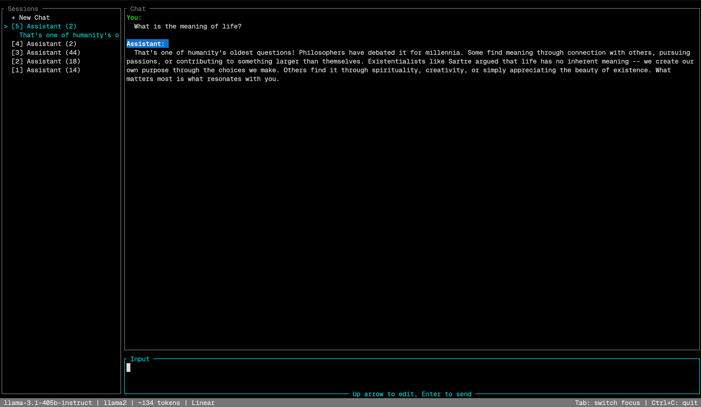

# LibLLM

A keyboard-driven terminal chat client for local LLMs. LibLLM focuses on text-completions APIs, branching conversations, encrypted local storage, character cards, worldbooks, and script-friendly CLI usage.



## Install

```sh
curl -fsSL https://raw.githubusercontent.com/wsquarepa/LibLLM/master/install.sh | sh
```

The install script supports Linux and macOS, asks which release channel to install, and writes the `libllm` binary to an existing install location or `~/.local/bin`. See [Installation](docs/install.md) for release downloads, source builds, and custom install locations.

## Quickstart

LibLLM requires a running llama.cpp-compatible server exposing an OpenAI-compatible `/v1/completions` endpoint. The default base URL is `http://localhost:5001/v1`.

> [!NOTE]
> LibLLM uses the text completions endpoint. It does not support `/v1/chat/completions`.

1. Start your completions server.
2. Run `libllm`.
3. Set a passkey when prompted, or use `libllm --data ./data --no-encrypt` for plaintext local data.
4. Type a message and press Enter.

Use another server URL with either form:

```sh
libllm --api-url http://localhost:8080/v1
LIBLLM_API_URL=http://localhost:8080/v1 libllm
```

## Common Commands

```sh
# Interactive TUI
libllm

# One-off prompt, not saved
libllm -m "Summarize this file" < document.txt

# Persistent scripted conversation
libllm -d ./project-data --no-encrypt -m "Explain quantum computing"
libllm -d ./project-data --no-encrypt --continue <session-id> -m "Explain it more simply"

# Roleplay session
libllm -c character_name -p persona_name

# Direct database inspection
libllm db sql "SELECT slug, name FROM personas;"
```

## Documentation

- [Installation](docs/install.md): install script, release assets, source builds, and update channels.
- [Usage Guide](docs/usage.md): TUI workflow, keyboard controls, slash commands, characters, files, search, exports, and macros.
- [CLI Reference](docs/cli.md): verified command-line flags, subcommands, authentication options, and database commands.
- [Configuration](docs/configuration.md): data directories, encryption, API/auth settings, sampling, backups, file attachments, summaries, themes, and macros.
- [Troubleshooting](docs/troubleshooting.md): connection problems, passkeys, TLS issues, stuck data, updates, and recovery.

## Highlights

- **Branching conversations:** retry or edit messages without losing older responses.
- **Local-first storage:** sessions, characters, personas, worldbooks, and prompts stay in your local data directory.
- **Encryption by default:** TUI sessions use a passkey-protected local database unless you opt into `--no-encrypt`.
- **Character and group chats:** attach one or more character cards, use personas, and steer multi-character sessions.
- **Backup and recovery:** automatic versioned backups with configurable retention; restore any snapshot with `libllm recover`.
- **Direct database access:** inspect, repair, or export your data with `libllm db sql`, `libllm db shell`, and `libllm db dump`.
- **Terminal-first workflow:** use the TUI for interactive work or `libllm -m` for scripts.

## Contributing

Bug reports and feature requests: [GitHub Issues](https://github.com/wsquarepa/LibLLM/issues)

Local development uses the Rust stable toolchain:

```sh
cargo build --workspace
cargo test --workspace
cargo clippy --workspace --all-targets
```

## License

This project is licensed under the [GNU General Public License v3.0](LICENSE).
